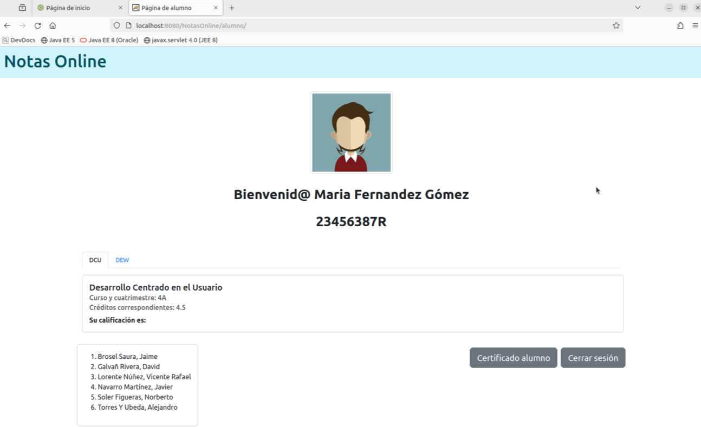
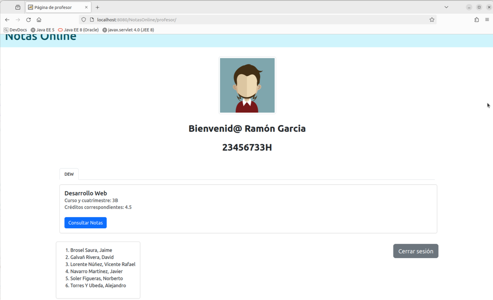
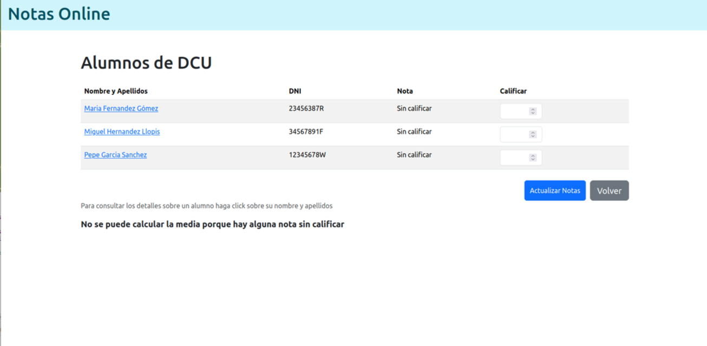
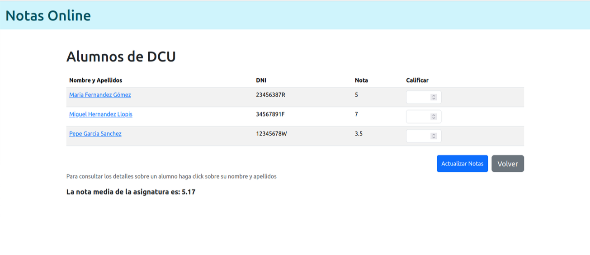
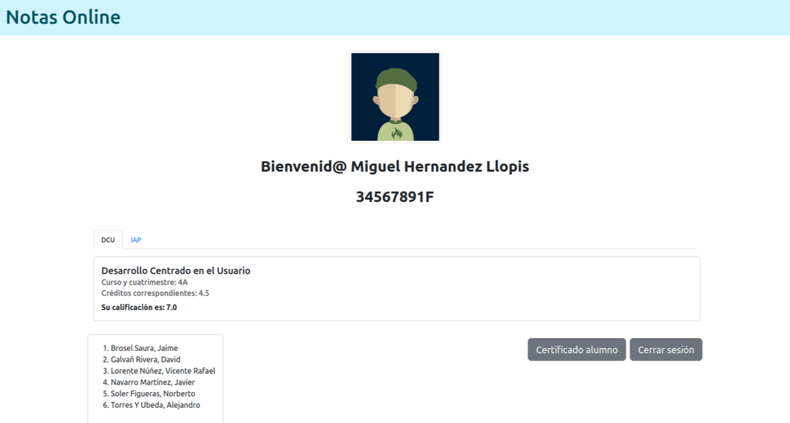
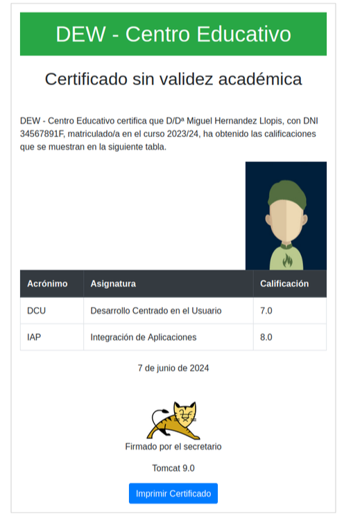
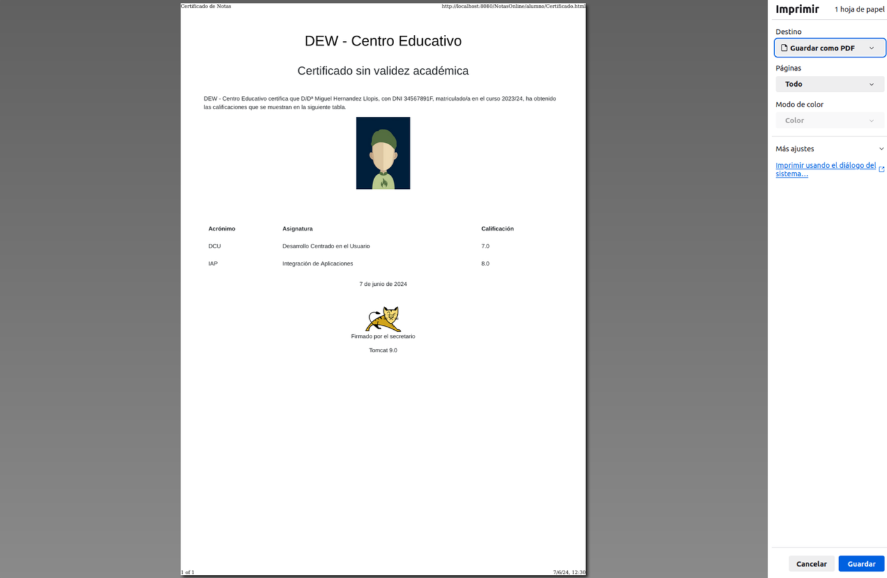
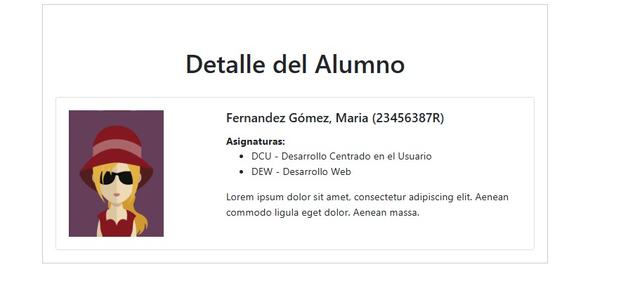

Proyecto realizado para la asignatura de Desarrollo Web de 3º año de ETSINF UPV utilizando java y tomcat.

# Documentación

---

## Esto es la documentación final del proyecto

A continuación se encontrará toda la documentación del proyecto, con las secuencias y todos los pasos realizados para completar el proyecto con su correspondiente explicación, así como capturas para detallar las pruebas realizadas para conseguir un correcto funcionamiento del proyecto.

# FRONTEND

## Página de entrada y enlace a la operación

Para la realización de la pagina de entrada llamada index.html se ha hecho uso de HTML. para empezar se ha creado la cabecera mediante el comando `<head>` donde se ha añadido el titulo de la página y los enlaces necesarios para poder hacer uso de Bootstrap, una vez hecho esto se ha cerrado la cabecera.

Seguidamente se crea el body, donde se añade un div principal de nombre "container". Dentro de este se ha dividido la página en 2 filas, la primera es la cabecera la cual contiene un div de tipo "row bg-primary-subtle", esto quiere decir que es una fila con el color de fondo azul cian. La segunda fila se crea mediante otro div de tipo row, dentro del mismo se crean 3 divs de tipos col. El primer div es de tamaño 6, esto se indica mediante "class="col-6"", para esto hay que tener en cuenta que Bootstrap divide los divs en 12 columnas, dentro de este div se encuentran los enlaces a las páginas de alumno y de profesor, las cuales contienen un filtro para que si no esta la sesión iniciada te redirijan a la página login.html. Después hay un div de tipo col-3 para dejar un margen entre los 2 lados y por último tenemos un col de tamaño 3 donde mediante un  `<h2>` indicamos el nombre de nuestro grupo y más abajo con un `<ol>`(lista ordenada> indicamos los participantes del mismo. Por último debajo del todo hay un div con nombre “position-absolute bottom-0 start-0”, esto hace que el texto tenga una posición absoluta y si se usara un scroll este texto siempre estaría fijo, bottom-0 y start-0 indican que el texto está debajo del todo y a la izquierda. Página de entrada y enlace a la operación


## Página de Login

Esta página se usa como filtro para que si se detecta que no esta la sesión iniciada te redirija a esta página. El head de la página está formado por los 4 links necesarios para hacer uso de Bootstrap la selección del charset UTF-8 y el título de la página que es “Inicio sesión”. Para el body, al igual que para la pagina de inicio hacemos uso de un div principal de nombre container en el que dentro tenemos una cabecera de tipo row en el que el color del fondo es azul cian con un `<h1>` de nombre Inicio de sesión. Después añadimos un div =”text-center” para que el texto se coloque alineado en el centro de la página, dentro de este hay un form mediante el cual pasamos los parámetros de nombre y contraseña. Con estos valores se llamará a j_security_check mediante post, este comprueba si los valores mandados coinciden con el de un usuario del sistema, si estos son erróneos te redirige a una página por defecto de Tomcat. En caso de que los datos sean correctos iremos a la página que queríamos acceder en un principio antes de que el filtro nos hiciera iniciar sesión


## Pagina del profesor

En primer lugar, para desarrollar la página web que recibirá el usuario se ha propuesto el uso de bootstrap, como guía y ayuda para obtener un css y un script predefinidos, que nos facilitará el trabajo a la hora de definir los estilos de nuestra página. Además, se ha optado por el uso de JQuery y Ajax, que permitirá la incorporación de java dentro del HTML, para poder manipular y gestionar de forma dinámica las respuestas que se recibirán de la API del CentroEducativo. 

La cabecera viene precedida del siguiente código donde también se ha elegido crear estilos css complementarios para opciones que no hemos podido resolver mediante el uso de bootstrap, como son los márgenes y las fuentes de las tarjetas usadas para mostrar las asignaturas de cada alumno.

```jsx
<!DOCTYPE html>
<html>
<head>
<meta charset="UTF-8">
<meta http-equiv="X-UA-Compatible" content="IE-edge">
<meta name="viewport" content="width=device-width, initial-scale=1">
<title>Página de alumno</title>

<link href="https://cdn.jsdelivr.net/npm/bootstrap@5.3.3/dist/css/bootstrap.min.css" rel="stylesheet" integrity="sha384-QWTKZyjpPEjISv5WaRU9OFeRpok6YctnYmDr5pNlyT2bRjXh0JMhjY6hW+ALEwIH" crossorigin="anonymous">
<style>
        .nav-tabs .nav-link {
            padding: 0.5rem 1rem; 
            font-size: 0.875rem; 
        }
        .card {
            margin: 0.5rem 0; 
        }
        .lista{
        	 position: absolute;
  			 top: 550px;
  			 left: 100px;
        }
        
</style>
<script src="https://ajax.googleapis.com/ajax/libs/jquery/3.6.0/jquery.min.js"></script>
<script src="https://cdn.jsdelivr.net/npm/bootstrap@5.3.3/dist/js/bootstrap.bundle.min.js" integrity="sha384-YvpcrYf0tY3lHB60NNkmXc5s9fDVZLESaAA55NDzOxhy9GkcIdslK1eN7N6jIeHz" crossorigin="anonymous"></script>
<script src="https://cdn.jsdelivr.net/npm/@popperjs/core@2.11.8/dist/umd/popper.min.js" integrity="sha384-I7E8VVD/ismYTF4hNIPjVp/Zjvgyol6VFvRkX/vR+Vc4jQkC+hVqc2pM8ODewa9r" crossorigin="anonymous"></script>
<script src="https://cdn.jsdelivr.net/npm/bootstrap@5.3.3/dist/js/bootstrap.min.js" integrity="sha384-0pUGZvbkm6XF6gxjEnlmuGrJXVbNuzT9qBBavbLwCsOGabYfZo0T0to5eqruptLy" crossorigin="anonymous"></script>
```

Siguiendo a esta descripción y dentro de otro script complementario, se ha tomado la decisión de usar JQuery y Ajax para realizar las llamadas a la API del CentroEducativo. Concretamente, se han desarrollado funciones que permiten obtener mediante un objeto JSON el nombre del alumno registrado, la lista de asignaturas de ese alumno interpretadas mediante elementos “card”, los detalles de una asignatura y las notas de un alumno en una asignatura. Estas funciones se activan cuando el usuario interactúa con la interfaz de la página web, cambiando entre las diferentes “cards”, donde cada una muestra las especificaciones de esa asignatura. Esto se ha llevado a cabo mediante la función que vemos a continuación, que realiza las actualizaciones necesarias al realizar el cargado de la página, conseguido mediante la línea `$(document).ready(function()`.

Dentro de esta función conseguimos obtener el objeto JSON con  `$.ajax({` y el url correspondiente de donde obtendremos ese objeto: `'/nol2324/api/alumno'` donde aclaramos que su `dataType: ‘json’` donde seleccionamos el tipo de datos a recibir. Si la obtención de estos datos se realiza correctamente, entrará en el caso `success: (data)` , función anónima que realiza la actualización de la información.

```jsx
<script>
$(document).ready(function() {
	 $.ajax({
	 url: '/nol2324/api/alumno',
	 dataType: 'json',
	 success: (data) => {
	 $('#usuario').text(data.nombre);
	 $('#apellidos').text(data.apellidos);
	 $('#dni').text(data.dni);
	 for (var i = 0; i < data.notas.length; i++) {
         var tabId = 'asignatura' + (i + 1);
         var activeClass = i === 0 ? 'active' : '';
         var showClass = i === 0 ? 'show' : '';

         // Crear pestaña
         $('#myTab').append(`
             <li class="nav-item" role="presentation">
                 <a class="nav-link ${activeClass}" id="${tabId}-tab" data-bs-toggle="tab" href="#${tabId}" role="tab" aria-controls="${tabId}" aria-selected="${i === 0}">
                     ${data.notas[i].asignatura}
                 </a>
             </li>
         `);

         // Crear contenido de la pestaña con el formato de la card proporcionada
         $('#myTabContent').append(`
             <div class="tab-pane fade ${showClass} ${activeClass}" id="${tabId}" role="tabpanel" aria-labelledby="${tabId}-tab">
                 <div class="card mt-3" style="width: 80rem;">
                     <div class="card-body">
                         <h5 class="card-title">${data.notas[i].nombre}</h5>
                         <h6 class="card-subtitle mb-2 text-body-secondary">Curso y cuatrimestre: ${data.notas[i].curso}${data.notas[i].cuatrimestre}</h6>
                         <h6 class="card-subtitle mb-2 text-body-secondary">Créditos correspondientes: ${data.notas[i].creditos}</h6>
                         <p class="card-text fw-bolder">Su calificación es: ${data.notas[i].nota}</p>
                     </div>
                 </div>
             </div>
         `);
     }
	 },
	 error: function(xhr, status, error) {
         console.error('Error al obtener el nombre del alumno:', error);
     },
	 
	 
	 })
	});
</script>
```

Mediante la primera línea de esta función anónima conseguimos que el texto perteneciente al  elemento con `id:usuario` se actualice al propio obtenido de ese objeto JSON para el atributo nombre del usuario, en este caso se realiza con `$('#usuario').text(data.nombre);` y lo mismo para los otros atributos de apellidos y dni del alumno.

A continuación se crea de forma dinámica las “cards” que servirán para mostrar las asignaturas que cursa cada alumno, según el número de asignaturas cambiará el número de “cards” creadas. Esto se ha llevado a cabo mediante un for que recorre ese array de asignaturas del objeto JSON y va creando cada objeto “card” con el id correspondiente y los valores, características y especificaciones correspondientes a cada asignatura. En este caso se muestra tanto cuatrimestre, curso, creditos, nombre completo y acrónimo de la asignatura correspondiente. 

Esto lo conseguimos con un `for (var i = 0; i < data.notas.length; i++)`  con longitud máxima el número de asignaturas, donde va entrando en los atributos asignados a cada asignatura como son cuatrimestre, curso, creditos, nombre completo y acrónimo, para asignarlos a cada parte del card correspondiente. Se ha creado una variable `tabId = 'asignatura' + (i + 1);` con la que conseguiremos actualizar el título de cada asignatura con el acrónimo correspondiente, que en este caso se realiza con: `${data.notas[i].asignatura}` .

Dentro de las cards tenemos otros atributos como un subtitulo que viene asignado por el nombre completo de la asignatura `<h5 class="card-title">${data.notas[i].nombre}</h5>` .

Y otros aspectos donde se introducen los créditos y el curso y cuatrimestre correspondiente a la asignatura `<h6 class="card-subtitle mb-2 text-body-secondary">Curso y cuatrimestre: ${data.notas[i].curso}${data.notas[i].cuatrimestre}</h6>
<h6 class="card-subtitle mb-2 text-body-secondary">Créditos correspondientes: ${data.notas[i].creditos}</h6>` .

Y finalmente la nota obtenida por el alumno expuesta en el texto propio del “card” mediante:       `<p class="card-text fw-bolder">Su calificación es: ${data.notas[i].nota}</p>` donde podemos apreciar el uso de bootstrap para resaltar este texto.

Como final de esta función apreciamos un caso `error:function(xhr, status, error) {
         console.error('Error al obtener el nombre del alumno:', error);
     },` donde en el caso en el que no pueda obtener de forma correcta los datos pertenecientes al JSON en el caso `success` imprime por pantalla un error correspondiente a la línea anterior.

A continuación en cuanto a la creación de la página web, en el body apreciamos el siguiente código:

```jsx
<body>

<h1 class="p-3 mb-2 bg-info-subtle text-info-emphasis">Notas Online</h1></br>

<div class="container tamaño">
</br>
<div class="fs-2 text-center">
<p class="fw-bold">Bienvenid@ <span id="usuario"> </span> <span id="apellidos"></span></p>
<p class="fw-bold" id="dni"></p>
</div>

<div class="container mt-5">
    <ul class="nav nav-tabs" id="myTab" role="tablist"></ul>
    <div class="tab-content" id="myTabContent"></div>
</div>
<div class="d-flex justify-content-between align-items-start botones">   
<div class="card lista">
  <div class="card-body">
    <ol>
	<li>Brosel Saura, Jaime </li>
	<li>Galvañ Rivera, David</li>
	<li>Lorente Núñez, Vicente Rafael</li>
	<li>Navarro Martínez, Javier </li>
	<li>Soler Figueras, Norberto</li>
	<li>Torres Y Ubeda, Alejandro</li>
	</ol>
  </div>
</div>
<div class="d-flex justify-content-end mt-3">
        <a href="Certificado.html" class="btn btn-secondary btn-lg me-2">Certificado alumno</a>
        <a href="/nol2324/logout" class="btn btn-secondary btn-lg">Cerrar sesión</a>
        </div>
</div>
</div>
</body>
```

Mediante uso de bootstrap conseguimos poner todos los elementos en las posiciones que buscamos y con los estilos correspondientes.

Hemos creado los elementos con los id usuario, apellidos y dni para luego poder llamarlos desde el script anteriormente explicado, que actualizará con los valores correspondientes esos títulos y párrafos. 

También se aprecia una lista con los nombres de los responsables del proyecto.

Y en la parte de la derecha tenemos dos botones, uno que conduce al certificado que podrá ser impreso por el alumno, y un botón para que el alumno pueda cerrar sesión, que nos conducirá de nuevo a la página principal, donde se nos pedirá de nuevo las credenciales de autenticación.

Como ejemplo de uso, vemos que una alumna con nombre y apellidos Maria Fernandez Gómez, con dni correspondiente 23456387R, se ha autentificado en nuestra página. 

Tras su autentificación se le redirige a su página correspondiente de alumno donde apreciamos la siguiente interfaz:

- Una foto por defecto para todos los usuarios.
- Los datos personales correspondientes al alumno.
- Las asignaturas cursadas por ese alumno, con su descripción, curso y créditos.
- La lista con los integrantes del grupo de trabajo.
- Los botones de “certificado alumno” y “cerrar sesión.



## Secuencia **profesor->asignaturas->alumn@s->nota**

En primer lugar, se ha realizado la página específica que muestra los detalles del profesor autenticado. Estos detalles son: foto de perfil asignada según su dni, nombre y apellidos así como el dni, una lista de asignaturas que se encuentra implementada mediante objetos card de bootstrap, así como todos las características referentes a cada una de estas asignaturas, como son los créditos, el curso, el cuatrimestre, el nombre y el acrónimo. 

Todos estos datos se han recogido mediante el uso de AJAX y jquery, donde obtenemos un objeto JSON desde donde podemos obtener los atributos correspondientes a cada uno de los objetos nombrados anteriormente, nombre, apellidos y dni. Un ejemplo de esto es: `$('#usuario').text(data.nombre);` donde mediante el atributo nombre del objeto JSON recibido como data, podemos obtener el nombre del profesor autenticado, y modificar la variable creada en el body del html con id=#usuario. Estos pasos los hemos repetido con los demás atributos. En cuanto a la lista de asignaturas, esto se vuelve algo más complejo, en nuestro caso hemos optado por recorrerla mediante un bucle for con límite el número de asignaturas `data.asignaturas.length`.  Para cada asignatura obtendremos el curso, cuatrimestre, créditos, nombre y acrónimo propio. Un ejemplo para obtener el nombre de la asignatura es el siguiente: `data.asignaturas[i].nombre` . De nuevo repetimos esto con los demás atributos propios de cada asignatura, con lo que conseguimos crear finalmente mediante objetos card, una interfaz ajustada para cada asignatura perteneciente a cada profesor.

Cabe destacar la forma en la que se ha obtenido el objeto JSON, el fragmento de código proporcionado utiliza jQuery para realizar una solicitud AJAX que obtiene un objeto JSON desde el servidor. Al utilizar `$(document).ready(function() { ... })`, se asegura que el código dentro de esta función se ejecute una vez que el documento HTML haya terminado de cargarse completamente. Dentro de esta función, se hace una llamada a `$.ajax({ ... })`, una utilidad de jQuery que permite realizar solicitudes asíncronas al servidor.

En este caso, la solicitud se envía a la URL `/nol2324/api/profesor`, especificada en la propiedad `url` mediante el método por defecto ‘GET’ . La propiedad `dataType` se establece en `'json'`, indicando que la respuesta del servidor se espera en formato JSON. La propiedad `success` define una función de callback que se ejecutará cuando la solicitud se complete exitosamente. Esta función recibe un parámetro `data`, que contiene el objeto JSON devuelto por el servidor. Con este parámetro data obtendremos los distintos valores para cada elemento que contiene el propio objeto JSON.

```jsx
<script>
$(document).ready(function() {
	 $.ajax({
	 url: '/nol2324/api/profesor',
	 dataType: 'json',
	 success: (data) => {
	 $('#usuario').text(data.nombre);
	 $('#apellidos').text(data.apellidos);
	 $('#dni').text(data.dni);
	 $('#foto').attr('src', '/nol2324/imgs/asignadas/'+data.dni+'.png');	
	 for (var i = 0; i < data.asignaturas.length; i++) {
         var tabId = 'asignatura' + (i + 1);
         var activeClass = i === 0 ? 'active' : '';
         var showClass = i === 0 ? 'show' : '';

         // Crear pestaña
         $('#myTab').append(`
             <li class="nav-item" role="presentation">
                 <a class="nav-link ${activeClass}" id="${tabId}-tab" data-bs-toggle="tab" href="#${tabId}" role="tab" aria-controls="${tabId}" aria-selected="${i === 0}">
                     ${data.asignaturas[i].acronimo}
                 </a>
             </li>
         `);

         // Crear contenido de la pestaña con el formato de la card proporcionada
         $('#myTabContent').append(`
             <div class="tab-pane fade ${showClass} ${activeClass}" id="${tabId}" role="tabpanel" aria-labelledby="${tabId}-tab">
                 <div class="card mt-3" style="width: 80rem;">
                     <div class="card-body">
                         <h5 class="card-title">${data.asignaturas[i].nombre}</h5>
                         <h6 class="card-subtitle mb-2 text-body-secondary">Curso y cuatrimestre: ${data.asignaturas[i].curso}${data.asignaturas[i].cuatrimestre}</h6>
                         <h6 class="card-subtitle mb-2 text-body-secondary">Créditos correspondientes: ${data.asignaturas[i].creditos}</h6>
                         <button type="button" class="btn btn-primary mt-3 consultar-notas" data-asignatura="${data.asignaturas[i].acronimo}">Consultar Notas</button>
                     </div>
                 </div>
             </div>
         `);
     }
	 },
	 error: function(xhr, status, error) {
         console.error('Error al obtener el nombre del alumno:', error);
     },
     
```

Dentro del propio `script` podemos apreciar adicionalmente como se ha creado dentro del objeto card, un botón que nos redirige a consultar las notas de los alumnos que se encuentran matriculados en la asignatura del profesor autenticado.  Sin embargo, para que este botón redirija al ser clicado, debe tener un evento asociado en JavaScript que realice esa acción. 

El código que se ha desarrollado para realizar esta función, utiliza jQuery para manejar el evento `click` en el botón con la clase `consultar-notas`, permitiendo guardar un dato en `localStorage` y redirigir al usuario a una nueva página. Cuando un botón con esta clase es pulsado, se obtiene el valor del atributo `data-asignatura` del botón y se almacena en la variable `asignatura`. Luego, este valor se guarda en `localStorage` bajo la clave `'asignatura'`, asegurando que la información persista incluso después de cerrar el navegador. Esta variable será usada en la página a la que se dirige el profesor, con la que podremos obtener los alumnos pertenecientes solamente a esa asignatura que hemos guardado mediante la clave `‘asignatura’` . Finalmente, se redirige al usuario a la página `alumnosynotas.html` , página donde figuran las notas pertenecientes a los alumnos matriculados en la asignatura que imparte este profesor,  mediante `window.location.href`.  El código propio de esta función es el siguiente:

```jsx
$(document).on('click', '.consultar-notas', function() {
	        var asignatura = $(this).data('asignatura');
	        localStorage.setItem('asignatura', asignatura); // Guardar en localStorage
	        window.location.href = 'alumnosynotas.html'; // Redirigir a la nueva página
	    }
```

Una imagen que muestra el correcto funcionamiento de la página web para el profesor con nombre de usuario y contraseña “ramon” es el siguiente.

Podemos observar que solamente imparte la asignatura de DEW, con su correspondientes detalles y el botón para consultar las notas de sus alumnos en la asignatura.

También apreciamos un botón “Cerrar sesión” con el que el usuario autenticado puede salir de la aplicación para que otro usuario pueda iniciar sesión. 



A continuación, se explicará como se ha realizado la página donde el profesor puede ver los alumnos matriculados en su asignatura.

En primer lugar se ha realizado un documento html denominado `alumnosynotas.html` , página donde será redirigido el profesor tras pulsar el botón de “Consultar Notas”.

Como vemos en el código, se obtiene el acrónimo de la asignatura sobre la que se ha pulsado el botón mediante la línea de código `const asignatura = localStorage.getItem('asignatura');` .              Este valor será usado más tarde para obtener el conjunto de alumnos pertenecientes a la asignatura que presenta ese acrónimo. Se obtendrá un objeto JSON, a través de la `url: /nol2324/api/notas?asignatura=${asignatura}` donde la variable asignatura como hemos dicho presenta el valor de la asignatura previa. Tras esto, y mediante el método ‘GET’, obtenemos el JSON con el que debemos interactuar para obtener los elementos y atributos que buscamos para desarrollar a medida el documento. 

Vamos a definir el html, en primer lugar se define una tabla con un número dinámico de filas, que se irán actualizando según el número de alumnos que cursen la asignatura. Esto se realiza con un for que recorre cada posición del JSON, y para cada una de estas posiciones obtiene el nombre, apellidos, su dni (mediante la variable alumno) y la nota correspondiente a la calificación obtenida. La nota inicialmente esta vacía, hasta que algún profesor de esa materia se encargue de calificar al alumno, cosa que se explicará más adelante.  

Siguiendo con la tabla, encontramos 4 columnas con valores distintos, la primera refiere al nombre y apellidos del alumno, la segunda al dni, la tercera a la nota actual, y la cuarta, a un elemento de entrada de tipo número que será usado por los profesores para calificar a los alumnos. 
Un input de tipo `number` es un campo de entrada en HTML que permite a los usuarios ingresar y modificar valores numéricos, donde se puede aplicar un rango como se ha hecho en nuestro caso, con valor máximo 10, mínimo 0 y un paso de 1 decimal entre cada nota, que se puede modificar mediante flechas dentro del propio input. La declaración del mismo es la siguiente: `<input type="number" class="numero form-control" min="0" max="10" step="0.1" />`

Además apreciamos un botón con el que se consigue actualizar las notas de los alumnos tras introducirlas en las entradas previas, y actualizar la nota media de la asignatura. 

También podemos obtener más detalles de los alumnos, haciendo click sobre el enlace que se encuentra en el nombre y apellidos de cada alumno, que nos redirige a una página que muestra más características de los mismos.

Tras explicar como se compone la interfaz de este documento, pasamos a explicar un poco el código y como se ha llevado a cabo la metodología para implementar un correcto funcionamiento con el que el profesor califica a los alumnos mediante AJAX.

Al recibir los datos, se actualiza el título de la página con el nombre de la asignatura y se procesa la lista de alumnos. Primero, los alumnos se ordenan alfabéticamente por nombre y apellidos. Luego, para cada alumno, se verifica si la nota está calificada o no. Si no hay una nota, se indica "Sin calificar"; de lo contrario, se suma la nota al total para calcular la media más adelante. Esta suma se guarda en la variable `var totalNotas = 0` , inicialmente con valor 0. Cada alumno y su información se agregan a la tabla en el cuerpo del documento HTML. 

Si alguna nota no está calificada, se muestra un mensaje indicando que no se puede calcular la media. Si todas las notas están calificadas, se calcula y muestra la nota media, dividiendo el valor de totalNotas entre el número total de asignaturas calificadas.

Cuando se hace clic en el botón "Actualizar Notas", se recopilan las nuevas notas ingresadas en los campos numéricos. Las notas se envían al servidor mediante otra petición AJAX mediante la url anterior `url: /nol2324/api/notas?asignatura=${asignatura}` pero esta vez con el método ‘PUT’. Si la actualización es exitosa, los datos se habrán enviado correctamente al servidor y las notas habrán sido actualizadas en la aplicación, cosa que se puede ver si iniciamos sesión con un alumno, donde en su lista de asignaturas observará la nota actualizada. Además se muestra una alerta de éxito para indicar al profesor que los cambios se han realizado correctamente,  y los campos de entrada se restablecen a vacío. Se calculará y actualizará de nuevo la media con estos nuevos valores de las calificaciones. Después, se recargan los datos para reflejar los cambios actualizados en la tabla. En caso de error al obtener o actualizar los datos, se muestra una alerta con el mensaje de error correspondiente para que el profesor introduzca de nuevo los valores.

El código correspondiente a esta actualización de notas, así como al calculo de la nota media, los valores correspondientes de los alumnos asignados a la tabla, donde también observamos su creación dentro del script, viene dado por el siguiente código:

```jsx
$(document).ready(function() {
    const asignatura = localStorage.getItem('asignatura');

    function cargarDatos() {
        if (asignatura) {
            $.ajax({
                url: `/nol2324/api/notas?asignatura=${asignatura}`,
                dataType: 'json',
                success: function(data) {
                    $('#asignatura-title').text(`Alumnos de ${asignatura}`);
                    var alumnos = data;
                    var totalNotas = 0;
                    var countNotas = 0;
                    var notaSinCalificar = false;
                    $('#alumnos-table tbody').empty();
                    
                    // Ordenar los alumnos por nombre y apellidos
                    alumnos.sort(function(a, b) {
                        var nombreA = a.nombre.toUpperCase() + " " + a.apellidos.toUpperCase();
                        var nombreB = b.nombre.toUpperCase() + " " + b.apellidos.toUpperCase();
                        if (nombreA < nombreB) {
                            return -1;
                        }
                        if (nombreA > nombreB) {
                            return 1;
                        }
                        return 0;
                    });

                    for (var i = 0; i < alumnos.length; i++) {
                        var nota = alumnos[i].nota === "" ? 'Sin calificar' : parseFloat(alumnos[i].nota);
                        if (alumnos[i].nota === "") {
                            notaSinCalificar = true;
                        } else {
                            totalNotas += nota;
                            countNotas++;
                        }

                        $('#alumnos-table tbody').append(`
                            <tr>
                                <td><a href="detalleAlumno.html?dni=${alumnos[i].alumno}">${alumnos[i].nombre} ${alumnos[i].apellidos}</a></td>
                                <td>${alumnos[i].alumno}</td>
                                <td>${nota}</td>
                                <td>
                                    <input type="number" class="numero form-control" min="0" max="10" step="0.1" />
                                </td>
                            </tr>
                        `);
                    }

                    if (notaSinCalificar) {
                        $('#notamedia').text("No se puede calcular la media porque hay alguna nota sin calificar");
                    } else {
                        var notamedia = totalNotas / countNotas;
                        $('#notamedia').text(`La nota media de la asignatura es: ${notamedia.toFixed(2)}`);
                    }
                },
                error: function(xhr, status, error) {
                    alert('Error al obtener los datos de los alumnos: ' + error);
                }
            });
        } else {
            console.error('No se encontró la asignatura');
        }
    }

    cargarDatos();

    // Controlador de eventos para el botón "Actualizar Notas"
    $('#actualizar-notas-btn').click(function() {
        var nuevasNotas = [];

        $('#alumnos-table tbody tr').each(function() {
            var dni = $(this).find('td:nth-child(2)').text();
            var notaInput = $(this).find('.numero');
            var nota = notaInput.val();

            if (nota !== '') {
                nuevasNotas.push({
                    dni: dni,
                    nota: parseFloat(nota)
                });
            }
        });

        $.ajax({
            url: `/nol2324/api/notas?asignatura=${asignatura}`,
            method: 'PUT',
            contentType: 'application/json',
            data: JSON.stringify(nuevasNotas),
            success: function(response) {
                alert('Notas actualizadas correctamente');
                // Restablecer los valores de los inputs a vacío
                $('#alumnos-table tbody tr').each(function() {
                    $(this).find('.numero').val('');
                });
                // Recargar los datos para reflejar los cambios
                cargarDatos();
            },
            error: function(xhr, status, error) {
                alert('Error al actualizar las notas: ' + error);
            }
        });
    });
});
</script>
```

Tras iniciar sesión con el profesor “manoli”, y tras pulsar en el botón de consultar notas, se nos redirige a esta página, donde, para su asignatura DCU, presenta 3 alumnos con sus correspondientes nombres, apellidos, dni y sus notas, que como hemos argumentado, inicialmente se encuentran “Sin calificar”. 

También vemos que la nota media no se puede calcular todavía puesto que hay notas sin calificar, en este caso, todas.

Una imagen que detalla este ejemplo es la siguiente:



A continuación, la profesora se dispone a evaluar a sus alumnos con las correspondientes notas 5,7 y 3,5. Tras pulsar el botón de “Actualizar Notas”, aparece una alerta que nos avisa de que las notas se han actualizado correctamente, cosa que también podemos apreciar ya que la columna “Nota” de la tabla se ha actualizado con los valores correspondientes a los introducidos en cada elemento de la columna “Calificar”.

Vemos también que se ha calculado la nota media de la asignatura sumando las notas de los alumnos y dividiéndola entre 3.

Una imagen que detalla este ejemplo es la siguiente:



Tras realizar la calificación podemos consultar si esta se ha actualizado correctamente en la aplicación si iniciamos sesión con uno de los alumnos que ha sido calificado en la asignatura DCU.

En este caso hemos iniciado sesión con el alumno “miguel” cuya contraseña también es “miguel”, que desde su página puede ver que su asignatura DCU ha sido calificada con una nota de 7, como anteriormente ha asignado su profesora.

Una imagen que detalla este ejemplo es la siguiente:



Tras esto también puede apreciar la calificación obtenida cuando se dirija a imprimir su certificado como alumno, que mostrará las asignaturas en la que está matriculado, así como las calificaciones obtenidas en las mismas. Para imprimirlo solo tiene que pulsar sobre el botón de “Imprimir Certificado”, que abrirá una nueva ventana para que el alumno pueda guardar o imprimir el archivo a su gusto.

Una imagen que muestra esta ejecución es la siguiente:





## Selección de fotografía para cada usuario

Primeramente, para poder hacer que cada usuario tenga una fotografía propia se ha accedido a la carpeta imgs, esta tenía dentro una carpeta ‘h’ (hombres) y ‘m’ (mujeres), además se ha creado una nueva carpeta llamada asignadas. Por cada usuario se ha accedido a la carpeta ‘h’ o ‘m’ y se le ha cambiado el nombre a los archivos .png y .pngb64 que tenían el mismo nombre, p.e. 1.png y 1.pngb64 pasan de tener ese nombre a {DNIusuario}.png y {DNIusuario}.pngb64 y se mueven a la carpeta asignadas. De esta forma todos los usuarios del sistema ahora tienen un foto distinta para cada uno. 

Después, en las diferentes páginas donde se quiere que aparezca la foto de cada alumno se deben realizar 2 pasos:

- Añadir la imagen donde se quiera que aparezca de forma visual mediante las etiqueta `` . Además si es necesario se podría añadir un class en la declaración de la imagen. Un ejemplo sería este:

```java

```

- Por otro lado, en el `<head>` hemos declarado un `<script>`  en el que dentro a través de Ajax, a través del cual conseguimos el DNI del usuario, hacemos que se inserte un source en la `` anterior indicando la ruta de la carpeta asignadas en el que el nombre del archivo será el <DNIusuario>.png. Un ejemplo de esto es el siguiente:

```jsx
$('#foto').attr('src', '/nol2324/imgs/asignadas/'+data.dni+'.png');	
```

El atributo `#foto` indica el elemento donde queremos insertar esta imagen, para ello ponemos # lo cual indica que nos referimos a un id y foto es el nombre del ``. Dentro de `attr`indicamos que atributo queremos añadir y su contenido. En este caso modificamos el atributo `src` para establecer correctamente el url del que se quiere recuperar la imagen correspondiente al dni de ese usuario.

**Detalles de un alumno.**

También hemos hecho una pagina para ver los detalles del alumno tanto si inicias sesión como  profesor o como alumno. La página de detalle de un alumno nos muestra información detallada sobre un alumno específico, incluyendo su nombre, apellidos, DNI, foto y las asignaturas en las que está matriculado. La página está diseñada para obtener los datos del alumno desde una API mediante una solicitud AJAX.

El código utilizado para realizar la página detalles se presenta a continuación, donde apreciamos que hemos hecho a mediante una petición AJAX, la recepción de los datos del alumno y a partir de estos se rellena la información necesaria para establecer los detalles del mismo.

La estructura básica de la página se define en un contenedor ‘div’ mediante la clase ‘container’, que se encuentra definida en BootStrap, al igual que otras clases usadas en diferentes clases.

Para el script hacemos una extracción de los datos del alumno mediante la URL modificada con el dni del alumno del que se busca recuperar estos detalles. Si este dni existe, realizamos la solicitud AJAX para obtener los datos del alumno desde el servidor, si no existe se mostrara un mensaje de error por consola (’No se encontró el DNI del alumno’). Si obtiene correctamente el objeto JSON de la url, pasará a realizar los cambios necesarios para implementar estos datos en la interfaz. El objeto JSON se guarda en la variable data, a la que más tarde se accederá atributo por atributo para recuperar sus valores y modificar los elementos correspondientes a la interfaz. Esto se hace accediendo a los id creados en ciertos elementos para modificar sus valores, asignando aquellos correspondientes al alumno, algún ejemplo es el correspondiente a línea de código `$('#apellidos').text(data.apellidos)` donde se obtiene el elemento con `id=#apellidos` para cambiar su valor por el correspondiente valor de apellidos del alumno.

```html
<!DOCTYPE html>
<html lang="es">
<head>
    <meta charset="UTF-8">
    <meta name="viewport" content="width=device-width, initial-scale=1.0">
    <title>Detalle del Alumno</title>
    <link href="https://stackpath.bootstrapcdn.com/bootstrap/4.5.2/css/bootstrap.min.css" rel="stylesheet">
    <style>
        .container {
            margin-top: 20px;
            max-width: 800px;
            border: 1px solid #ccc;
            padding: 20px;
        }
        .header {
            text-align: center;
            margin-bottom: 30px;
        }
        .photo {
            float: left;
            width: 150px;
            height: 200px;
            margin-right: 20px;
        }
        .footer {
            text-align: center;
            margin-top: 20px;
        }
    </style>
    <script src="https://ajax.googleapis.com/ajax/libs/jquery/3.6.0/jquery.min.js"></script>
    <script src="https://cdn.jsdelivr.net/npm/bootstrap@5.3.3/dist/js/bootstrap.bundle.min.js" integrity="sha384-YvpcrYf0tY3lHB60NNkmXc5s9fDVZLESaAA55NDzOxhy9GkcIdslK1eN7N6jIeHz" crossorigin="anonymous"></script>
    <script src="https://cdn.jsdelivr.net/npm/@popperjs/core@2.11.8/dist/umd/popper.min.js" integrity="sha384-I7E8VVD/ismYTF4hNIPjVp/Zjvgyol6VFvRkX/vR+Vc4jQkC+hVqc2pM8ODewa9r" crossorigin="anonymous"></script>
    <script src="https://cdn.jsdelivr.net/npm/bootstrap@5.3.3/dist/js/bootstrap.min.js" integrity="sha384-0pUGZvbkm6XF6gxjEnlmuGrJXVbNuzT9qBBavbLwCsOGabYfZo0T0to5eqruptLy" crossorigin="anonymous"></script>
    <script>
        $(document).ready(function() {
        	const url = new URL(window.location.href);
        	const dni = url.searchParams.get("dni");
        	console.log("dni: "+dni);
            if (dni) {
                $.ajax({
                    url: `/nol2324/api/getalumno?dni=${dni}`,
                    dataType: 'json',
                    success: function(data) {
                        $('#nombre').text(data.nombre);
                        $('#apellidos').text(data.apellidos);
                        $('#dni').text(data.dni);
                        $('#foto').attr('src', '/nol2324/imgs/asignadas/' + data.dni + '.png');
                        
                        // Construir la lista de asignaturas
                        var asignaturasHtml = '<strong>Asignaturas:</strong><ul>';
                        for (var i = 0; i < data.asignaturas.length; i++) {
                            asignaturasHtml += '<li>' + data.asignaturas[i].asignatura + ' - ' + data.asignaturas[i].nombre + '</li>';
                        }
                        asignaturasHtml += '</ul>';
                        $('#asignaturas').html(asignaturasHtml);
                    },
                    error: function(xhr, status, error) {
                        console.error('Error al obtener los datos del alumno:', error);
                    }
                });
            } else {
                console.error('No se encontró el DNI del alumno en localStorage');
            }
        });
    </script>
</head>
<body>
    <div class="container">
        <div class="header">
            <h1 class="mt-5">Detalle del Alumno</h1>
        </div>
        <div class="card mt-3">
            <div class="card-body">
                <div class="row">
                    <div class="col-md-4">
                        
                    </div>
                    <div class="col-md-8">
                        <h5 class="card-title"><span id="apellidos"></span>, <span id="nombre"></span> (<span id="dni"></span>)</h5>
                        <p id="asignaturas" class="card-text">[Matriculad@ en: ...]</p>
                        <p id="infoAdicional" class="card-text">Lorem ipsum dolor sit amet, consectetur adipiscing elit. Aenean commodo ligula eget dolor. Aenean massa.</p>
                    </div>
                </div>
            </div>
        </div>
    </div>
</body>
</html>

```

En cuanto al aspecto correspondiente a esta página de detalles, se mostrará una foto correspondiente al alumno, así como su nombre, apellidos y dni.

También se puede apreciar las asignaturas en las que se encuentra matriculado el alumno.

Una imagen que corresponde a este ejemplo es la siguiente:



# BACKEND

## Autorización

El sistema de autorización permite a los usurarios ingresar en el sistema utilizando unas credenciales diferentes a las del CentroEducativo.

### Paridad entre nuestros usuarios y los del Centro Educativo

Para conseguir la relación entre nuestro usuarios y los del CentroEducativo se ha creado un archivo ubicado en `WEB-INF/users.properties`  donde se almacenan los **dni** y las **contraseñas** del centro educativo.

```
...
maria.dni=23456387R
maria.pass=123456
miguel.dni=34567891F
miguel.pass=123456
...
```

Esta información se extrae al iniciar la web gracias a la clase **PropiertiesInitialicer**, un listener:

```java
public class PropertiesInitializer implements ServletContextListener {	
	@Override
	public void contextInitialized(ServletContextEvent sce) {
			
		Properties usersp = new Properties();
		try (InputStream input = sce.getServletContext().getResourceAsStream("/WEB-INF/users.properties")) {
			if (input != null) {
				usersp.load(input);
				sce.getServletContext().setAttribute("users", usersp);				
			} else {
				System.out.println("No se encontró el archivo users.properties");
			}
		} catch (IOException ex) {
			ex.printStackTrace();
		}
	}
}
```

Esta añadido en el web.xml:

```xml
...
<listener>
    <listener-class>listener.PropertiesInitializer</listener-class>
</listener>
...
```

Para recoger un valor es necesario utilizar el siguiente código (esto solo lo realizara el AuthFilter, una vez iniciado sesión, el **dni** se podra conseguir con **session.getAtribute(”dni”)** :

```java
String dni = userParams.getProperty(username + ".dni");
String password = userParams.getProperty(username + ".pass");
```

## Inicio de sesión

Para el inicio de sesión se ha usado el integrado en Tomcat, para ello se ha configurado en el web.xml:

```xml
...
<login-config>
    <auth-method>FORM</auth-method>
    <form-login-config>
      <form-login-page>/login.html</form-login-page>
      <form-error-page>/error.html</form-error-page>
    </form-login-config>
</login-config>

<security-role>
    <role-name>alumno</role-name>
</security-role>
<security-role>
    <role-name>profesor</role-name>
</security-role>

<security-constraint>
		<web-resource-collection>
			<web-resource-name>ProtegidoAlumnos</web-resource-name>
			<url-pattern>/api/*</url-pattern>
			<url-pattern>/alumno/*</url-pattern>
		</web-resource-collection>
		<auth-constraint>
			<role-name>alumno</role-name>
		</auth-constraint>
	</security-constraint>
	
	<security-constraint>
		<web-resource-collection>
			<web-resource-name>ProtegidoProfesores</web-resource-name>
			<url-pattern>/api/*</url-pattern>
			<url-pattern>/profesor/*</url-pattern>
		</web-resource-collection>
		<auth-constraint>
			<role-name>profesor</role-name>
		</auth-constraint>
	</security-constraint>
...
```

Dentro del `login.html` del formulario de *login* se utiliza los *names* especiales **j_username** y **j_password**, además de el *action* **j_security_check** para que Tomcat lo intercepte y inicie sesión al usuario.

```jsx
<form action="j_security_check" method="post">
		<p>Usuario: <input type="text" name="j_username"> </p>
		<p>Contraseña: <input type="password" name="j_password"> </p>
		<p><input type="submit" value="Iniciar sesión">	
</form>
```

La clase **AuthFilter** permite que, una vez que un usuario inicia sesión en el sistema, se le asigna un atributo en la sesión **dni**. También consigue la **key** y **cookie** del usuario en el Centro Educativo y la incluye en los atributos del mismo nombre. 

```java
public class AuthFilter extends HttpFilter implements Filter {
  static FilterConfig config;
  
	public void doFilter(ServletRequest request, ServletResponse response, FilterChain chain) throws IOException, ServletException {
		
		HttpServletRequest httpRequest = (HttpServletRequest) request;
        HttpServletResponse httpResponse = (HttpServletResponse) response;
        HttpSession session = httpRequest.getSession(false);    
            
	      //En caso de no tener la key
        if (session != null && httpRequest.getRemoteUser() != null && session.getAttribute("key") == null) {
        	
        	String username = httpRequest.getRemoteUser(); // Obtener el nombre de usuario
        	
            Properties userParams = (Properties) config.getServletContext().getAttribute("users");
            String key = null;            
            String dni = userParams.getProperty(username + ".dni");
            HttpCookie galleta = null;           
            String password = userParams.getProperty(username + ".pass");            
            
            String url = "http://localhost:9090/CentroEducativo/login";
            
            String requestBody = "{\"dni\": \"" + dni + "\", \"password\": \"" + password + "\"}";

            
            HttpClient httpClient = HttpClient.newBuilder().build();

            // Crear una solicitud HTTP POST
            HttpRequest req = HttpRequest.newBuilder()
                    .uri(URI.create(url))
                    .header("Content-Type", "application/json")
                    .POST(HttpRequest.BodyPublishers.ofString(requestBody))
                    .build();

            try {
                // Enviar la solicitud y obtener la respuesta
                HttpResponse<String> resp = httpClient.send(req, HttpResponse.BodyHandlers.ofString());
                
                if (resp.statusCode() == 200) {                	
                    // Obtener las cookies de la respuesta
                    
                    HttpHeaders headers = resp.headers();
                    List<String> cookies = headers.allValues("Set-Cookie");

                    // Buscar la cookie JSESSIONID
                    for (String cookie : cookies) {
                        HttpCookie httpCookie = HttpCookie.parse(cookie).get(0);
                        if (httpCookie.getName().equals("JSESSIONID")) {
                            String valorCookie = httpCookie.getValue();
                            
                            galleta = httpCookie;
                        }
                    }                    
                	key = resp.body();
                } else {
                	LogUtil.log("La solicitud no se completó correctamente. Código de estado: " + resp.statusCode());
                }
            } catch (Exception e) {
            	LogUtil.log("Se produjo un error al enviar la solicitud: " + e.getMessage());
            }
	          //Añadimos los atributos a la sesión
            session.setAttribute("dni", dni);
            session.setAttribute("key",key );
            session.setAttribute("cookie",galleta);
        }
        

		// pass the request along the filter chain
		chain.doFilter(request, response);
	}

	/**
	 * @see Filter#init(FilterConfig)
	 */
	public void init(FilterConfig fConfig) throws ServletException {
		config = fConfig;
	}

}
```

Añadido en el web.xml:

```xml
<filter>
		<display-name>AuthFilter</display-name>
		<filter-name>AuthFilter</filter-name>
		<filter-class>AuthFilter</filter-class>
</filter>
<filter-mapping>
		<filter-name>AuthFilter</filter-name>
		<url-pattern>/*</url-pattern>
</filter-mapping>
```

### tomcat-users.xml

El archivo `tomcat-users.xml` con los usuarios añadidos a la web:

```xml
<tomcat-users xmlns="http://tomcat.apache.org/xml" xmlns:xsi="http://www.w3.org/2001/XMLSchema-instance" xsi:schemaLocation="http://tomcat.apache.org/xml tomcat-users.xsd" version="1.0">
<role rolename="profesor"/>
<role rolename="alumno"/>
<user username="test1" password="test1" roles="alumno"/>
<user username="profe" password="profe" roles="profesor"/>
<user username="maria" password="maria" roles="alumno"/>
<user username="pepe" password="pepe" roles="alumno"/>
<user username="miguel" password="miguel" roles="alumno"/>
<user username="laura" password="laura" roles="alumno"/>
<user username="minerva" password="minerva" roles="alumno"/>
<user username="ramon" password="ramon" roles="profesor"/>
<user username="pedro" password="pedro" roles="profesor"/>
<user username="manolin" password="manolin" roles="profesor"/>
<user username="joan" password="joan" roles="profesor"/>
</tomcat-users>

```

## Cerrar sesión

Para permitir a los usuarios cerrar sesión se ha creado el servlet **Logout** con la URL: `/nol2324/logout` .

```java
public class Logout extends HttpServlet {
	private static final long serialVersionUID = 1L;
    
    public Logout() {
        super();        
    }
    	
	protected void doGet(HttpServletRequest request, HttpServletResponse response) throws ServletException, IOException {
		// Invalidar la sesión
        HttpSession session = request.getSession(false); // Obtener la sesión actual, si existe
        if (session != null) {
            session.invalidate();
        }
        
        // Realizar logout
        LogUtil.log(request,"logout");
        request.logout();
        
        // Redirigir a la página de inicio o login
        response.sendRedirect(request.getContextPath() + "/index.html");
	}

	protected void doPost(HttpServletRequest request, HttpServletResponse response) throws ServletException, IOException {
		doGet(request, response);
	}
}
```

## Petición para obtener la información del alumno actual

Al principio pensamos en compartir la **key** y **cookie** del CentroEducativo con el frontend, y desde ahí realizar las consultas a este. El problema surgió al realizar varias pruebas. Nos dimos cuenta que el CentroEducativo carecía de cierta seguridad, permitiendo a un alumno con sus credenciales poder ver, por ejemplo, los alumnos existentes con `/CentroEducativo/alumnos` . Debido a esto, decidimos utilizar nuestro backend de intermediario, sin compartir las **keys** con el frontend.

El código creado para interactuar con la API de `CentroEducativo` define un servlet llamado `AlumnService` que maneja las solicitudes HTTP relacionadas con la información de un alumno y sus asignaturas desde el sistema de gestión educativa. El servlet responde a solicitudes `GET` y `POST`, y utiliza métodos de la clase `Utils` (en este caso solo se utiliza clase `sendGetRequest`)para enviar solicitudes HTTP y procesar las respuestas.

```java

import org.apache.tomcat.util.json.JSONParser;
import org.json.*;

import javax.servlet.ServletException;
import javax.servlet.http.HttpServlet;
import javax.servlet.http.HttpServletRequest;
import javax.servlet.http.HttpServletResponse;
import javax.servlet.http.HttpSession;

import java.io.IOException;
import java.io.PrintWriter;
import java.net.HttpCookie;
import java.net.URI;
import java.net.http.HttpClient;
import java.net.http.HttpRequest;
import java.net.http.HttpResponse;

import utils.Utils;

/**
 * Servlet implementation class AlumnService
 */
public class AlumnService extends HttpServlet {
	private static final long serialVersionUID = 1L;

	private static final String BASE_URL = "http://localhost:9090/CentroEducativo";
	private static final String ALUMNO_URL = "http://localhost:9090/CentroEducativo/alumnos";
	//private static final String NOTAS_URL = "/asignaturas";
    /**
     * Default constructor. 
     */
    public AlumnService() {
        // TODO Auto-generated constructor stub
    }

	
...
```

Al principio del codigo la clase `AlumnService` extiende `HttpServlet`, lo que le permite manejar solicitudes HTTP y se definen constantes para las URL base y específicas del servicio de alumnos y asignaturas (las variables `BASE_URL` y `ALUMNO_URL`).

```java
...

/**
	 * @see HttpServlet#doGet(HttpServletRequest request, HttpServletResponse response)
	 */
	protected void doGet(HttpServletRequest request, HttpServletResponse response) throws ServletException, IOException {
		  HttpSession sesion = request.getSession(false);
			if(sesion == null) return;
		    String key = (String) sesion.getAttribute("key");
		    String id = (String) sesion.getAttribute("dni");
		    HttpCookie galleta = (HttpCookie) sesion.getAttribute("cookie");
		    if (key == null || key.isEmpty()) {
		        response.sendError(HttpServletResponse.SC_BAD_REQUEST, "Sesión no iniciada");
		        return;
		    }
		    if (id == null || id.isEmpty()) {
		        response.sendError(HttpServletResponse.SC_BAD_REQUEST, "DNI del alumno es requerido");
		        return;
		    }
		    String alumnoInfo = null;
		    int status = 0;
		    try {
		    	HttpResponse<String> rrr = Utils.sendGetRequest(ALUMNO_URL+"/" + id+"?key="+key,galleta);
		    	if (rrr.statusCode() != 200 && rrr.statusCode() != 201 && rrr.statusCode() != 204) {
		            throw new RuntimeException("Error en la petición: " + rrr.statusCode());
		        }
		    	
			    status = rrr.statusCode();
		        alumnoInfo = rrr.body();
		        JSONObject json = new JSONObject(alumnoInfo);
		        
		        HttpResponse<String> rrr2 = Utils.sendGetRequest(ALUMNO_URL+ "/" + id+"/asignaturas?key="+key,galleta);
		    	if (rrr2.statusCode() != 200 && rrr2.statusCode() != 201 && rrr2.statusCode() != 204) {
		            throw new RuntimeException("Error en la petición 2: " + rrr2.statusCode());
		        }
		    	JSONArray notas = new JSONArray(rrr2.body());		    	
		    	
		    	HttpResponse<String> rrr3 = Utils.sendGetRequest(BASE_URL+ "/asignaturas?key="+key,galleta);
		    	if (rrr3.statusCode() != 200 && rrr3.statusCode() != 201 && rrr3.statusCode() != 204) {
		            throw new RuntimeException("Error en la petición 2: " + rrr3.statusCode());
		        }
		    	JSONArray asignaturas = new JSONArray(rrr3.body());	
		    	
		    	for (int i = 0; i<notas.length();i++) {
		    		for(int j= 0; j<asignaturas.length();j++) {
		    			JSONObject nota = notas.getJSONObject(i);
		    			JSONObject asig = asignaturas.getJSONObject(j);
		    			
		    			if(nota.getString("asignatura").equalsIgnoreCase(asig.getString("acronimo"))) {
		    				nota.put("nombre", asig.getString("nombre"));
		    				nota.put("curso", asig.getInt("curso"));
		    				nota.put("cuatrimestre", asig.getString("cuatrimestre"));
		    				nota.put("creditos", asig.getFloat("creditos"));
		    				break;
		    			}
		    			
		    		}
		    	}
		    	
		    	json.put("notas", notas);
		    	
		        
		        response.setContentType("application/json");
		        PrintWriter out = response.getWriter();
		        out.print(JSONObject.valueToString(json));
		        out.flush();
		    } catch (Exception e) {
		        response.sendError(HttpServletResponse.SC_INTERNAL_SERVER_ERROR, "Error al obtener la información del alumno." + " status:"+ status+",  otra info: " + alumnoInfo   + "\n"+e.getMessage() +"\n\n "+ e.getLocalizedMessage());
		        
		    }
	    }
	

```

Posteriormente se crea el metodo `doGet` el cual maneja las solicitudes `GET` y realiza las siguientes operaciones:

- Sesión y Validaciones: Obtiene la sesión actual y verifica si existe. Si no existe, finaliza el procesamiento. Luego, extrae los atributos `key`, `dni`, y `cookie` de la sesión. Si `key` o `dni` están vacíos, responde con un error de solicitud incorrecta (400).
- Solicitud de Información del Alumno: Utiliza el método `sendGetRequest` de la clase `Utils` para enviar una solicitud `GET` a la URL del alumno con su DNI y clave. Verifica el código de estado de la respuesta y lanza una excepción si no es exitoso.

```java
public static HttpResponse<String> sendGetRequest(String url, HttpCookie cookie) throws Exception {
	    HttpClient client = HttpClient.newHttpClient();

	    // Crear el valor del encabezado 'Cookie' a partir de la HttpCookie
	    String cookieHeader = cookie.getName() + "=" + cookie.getValue();

	    HttpRequest request = HttpRequest.newBuilder()
	            .uri(new URI(url))
	            .GET()
	            .header("Cookie", cookieHeader)
	            .build();

	    HttpResponse<String> response = client.send(request, HttpResponse.BodyHandlers.ofString());

	    if (response.statusCode() != 200) {
	        throw new RuntimeException("Error en la petición: " + response.statusCode());
	    }
	    return response;
	}
```

- Solicitud de Notas del Alumno: Envía otra solicitud `GET` para obtener las asignaturas del alumno con el mismo proceso de validación de respuesta.
- Solicitud de Información de Asignaturas: Envía una solicitud `GET` para obtener todas las asignaturas del sistema educativo y valida la respuesta.
- Procesamiento de Datos: Combina la información de las notas del alumno con la información detallada de las asignaturas, añadiendo detalles como nombre, curso, cuatrimestre y créditos.
- Construcción de la Respuesta: Construye una respuesta JSON que contiene la información del alumno y sus notas enriquecidas, y la envía al cliente.

Finalmente, el método **`doPost`** simplemente redirige las solicitudes `POST`al método **`doGet`**. Esto permite que ambas tipos de solicitudes sean manejadas de la misma manera, centralizando la lógica en un solo lugar.

```java
...
protected void doPost(HttpServletRequest request, HttpServletResponse response) throws ServletException, IOException {
        doGet(request, response);
    }
```

En conclusion, cuando se realiza una solicitud `GET` a este servlet, se espera que la sesión contenga los atributos `key`, `dni` y `cookie`. El servlet envía solicitudes a los servicios correspondientes para obtener la información del alumno y sus asignaturas. Luego, procesa los datos y envía una respuesta `JSON` detallada al cliente. Esta respuesta `JSON` final incluye la información del alumno, junto con un arreglo de sus notas. Cada nota incluye detalles adicionales sobre la asignatura, como nombre, curso, cuatrimestre y créditos. Si ocurre algún error durante el proceso de solicitud y respuesta, el servlet responde con un error interno del servidor (código de estado 500). Además, proporciona detalles del error en el mensaje de respuesta para facilitar la depuración y el diagnóstico del problema.

Ejemplo de la respuesta recibida a hacer **GET** sobre `/nol2324/api/alumno`:

```json
{
    "apellidos": "Fernandez Gómez",
    "notas": [
        {
            "cuatrimestre": "A",
            "asignatura": "DCU",
            "curso": 4,
            "creditos": 4.5,
            "nota": "",
            "nombre": "Desarrollo Centrado en el Usuario"
        },
        {
            "cuatrimestre": "B",
            "asignatura": "DEW",
            "curso": 3,
            "creditos": 4.5,
            "nota": "",
            "nombre": "Desarrollo Web"
        }
    ],
    "nombre": "Maria",
    "dni": "23456387R"
}
```

## Obtención de detalles para un alumno desde la sesión de un profesor

Para la obtención de los detalles de un alumno dada la sesión de un profesor se ha creado el servlet “GetAlumno”. Este servlet ha sido mapeado a la URL `/nol2324/api/GetAlumno` y pretende que un usuario profesor sea capaz de visualizar los detalles (DNI, nombre y apellidos) de un alumno, siempre y cuando este pertenezca a una de las asignaturas que imparte. Se puede acceder al servlet utilizando una petición **GET** con un parámetro `?dni` que especifique el DNI del alumno a buscar.

- En primer lugar se comprueba que el usuario ha iniciado sesión y pertenece al rol “profesor”. Si es asi se guarda su cookie, su clave y su DNI:

```java
if (sesion == null) { // Si no tiene sesion
			response.sendError(403);
			return;
		}
		
		if (!request.isUserInRole("profesor")) { // Si no se profesor
			response.sendError(403);
			return;
		}
		String key = (String) sesion.getAttribute("key");
	    String id = (String) sesion.getAttribute("dni");
	    HttpCookie galleta = (HttpCookie) sesion.getAttribute("cookie");
	    
	    ...
	    
	    if (dniAlumno == null || dniAlumno.isEmpty()) { // Si no se ha introducido el DNI de ningun alumno
	        response.sendError(HttpServletResponse.SC_BAD_REQUEST, "Alumno no valido");
	        return;
	    }
```

- A continuación se obtienen los detalles del alumno o se devuelve un error si este no existe:

```java
// Obten el alumno especificado con su DNI
				dniAlumno=request.getParameter("dni");
	    	HttpResponse<String> res2 = Utils.sendGetRequest(BASE_URL+"/alumnos/" + dniAlumno + "?key=" + key, galleta);
	    	if (res2.statusCode() != 200 && res2.statusCode() != 201 && res2.statusCode() != 204) {
	    		throw new RuntimeException("Error en la petición para obtencion de alumno: " + res2.statusCode());
	    	}
	    	JSONObject alum = null;
	    	try {
	    		alum = new JSONObject(res2.body());
	    		if (alum.length() <= 0) response.sendError(HttpServletResponse.SC_INTERNAL_SERVER_ERROR, "Este no es el alumno que estas buscando...");
	    	} catch (Exception e) {
	    		response.sendError(HttpServletResponse.SC_INTERNAL_SERVER_ERROR, "Este no es el alumno que estas buscando...");
	    	}
```

- Para poder comprobar si el alumno pertenece a alguna de las asignaturas del profesor se realiza una consulta sobre las asignaturas que imparte el profesor y otra sobre a cuales asiste el alumno:

```java
//Asignaturas del profesor
	        HttpResponse<String> res3 = Utils.sendGetRequest(BASE_URL+"/profesores/" + id + "/asignaturas?key=" + key, galleta);
	    	if (res3.statusCode() != 200 && res3.statusCode() != 201 && res3.statusCode() != 204) {
	            throw new RuntimeException("Error en la petición (Asignaturas del profesor): " + res3.statusCode());
	        }
	    	String rawAsig = res3.body();
	    	JSONArray asig = new JSONArray(rawAsig);
	    	//Asignaturas del alumno
	        HttpResponse<String> res4 = Utils.sendGetRequest(BASE_URL+"/alumnos/" + dniAlumno + "/asignaturas?key=" + key, galleta);
	    	if (res4.statusCode() != 200 && res4.statusCode() != 201 && res4.statusCode() != 204) {
	            throw new RuntimeException("Error en la petición (Asignaturas del alumno): " + res4.statusCode());
	        }
	    	String rawAsigAlum = res4.body();
	    	JSONArray asigAlum = new JSONArray(rawAsigAlum);
```

- Finalmente se busca una asignatura del alumno que sea impartida por el profesor. Si se encuentra, se devuelven los detalles del alumno, en caso contrario se devuelve un error.

```java
boolean found = false;
	    	for(int i = 0; i < asigAlum.length(); i++) { // Busca en todas las asignaturas del alumno *
	    		String asignaturaAlum = asigAlum.getJSONObject(i).getString("asignatura");
	    		for (int e = 0; e < asig.length(); e++) {
	    			String asignaturaProfe = asig.getJSONObject(e).getString("acronimo");
	    			if (asignaturaAlum.equals(asignaturaProfe)) { // * alguna asignatura que coincida con las del profesor
	    				found = true;
	    				break; // Aborta el bucle si lo encuentra
	    			}
	    		}
	    		if (found) break;
	    	}
	    	
	    	if (!found) { // Si no se ha encontrado se devuelve un error
	    		response.sendError(HttpServletResponse.SC_INTERNAL_SERVER_ERROR, "Este alumno no esta en ninguna de tus asignaturas.");
	    	}
	    	// Devuelve los detalles del alumno
	    	PrintWriter out = response.getWriter();
	    	response.setContentType("application/json");
	    	out.print(alum);
	      out.flush();
```

## Petición para obtener la información del profesor actual

Este servlet se llama **ProfeService,** mediante una petición **get** a ****la dirección `/nol2324/api/profesor` , la cual devuelve un json así:

```json
{
    "apellidos": "Valderas",
    "nombre": "Pedro",
    "asignaturas": [
        {
            "cuatrimestre": "A",
            "curso": 4,
            "creditos": 4.5,
            "nombre": "Integración de Aplicaciones",
            "acronimo": "IAP"
        },
        {
            "cuatrimestre": "A",
            "curso": 4,
            "creditos": 4.5,
            "nombre": "Desarrollo Centrado en el Usuario",
            "acronimo": "DCU"
        }
    ],
    "dni": "10293756L"
}
```

Como se puede observar, se han concatenado diferentes peticiones del CentroEducativo para que, con una petición a nuestra api, pueda obtener toda la información necesaria para la pagina del profesor. 

En el siguiente código se puede observar que se unen **dos peticiones** al CentroEducativo:

```java
protected void doGet(HttpServletRequest request, HttpServletResponse response) throws ServletException, IOException {		
			HttpSession sesion = request.getSession(false);
			if(sesion == null) return;
			//Comprobamos rol
			if (!request.isUserInRole("profesor")) {
				response.sendError(403);
				return;
			}
			//Atributos de la sesión
		    String key = (String) sesion.getAttribute("key");
		    String id = (String) sesion.getAttribute("dni");
		    HttpCookie galleta = (HttpCookie) sesion.getAttribute("cookie");
		    //Comprobaciones varias
		    if (key == null || key.isEmpty()) {
		        response.sendError(HttpServletResponse.SC_BAD_REQUEST, "Sesión no iniciada, se requiere cerrar sesión");
		        return;
		    }
		    if (id == null || id.isEmpty()) {
		        response.sendError(HttpServletResponse.SC_BAD_REQUEST, "DNI del profesor es requerido, se requiere cerrar sesión");
		        return;
		    }
		    
		    try {
		    	//Información del Profesor       #Petición 1
		    	HttpResponse<String> res1 = Utils.sendGetRequest(BASE_URL+"/profesores/" + id+"?key="+key,galleta);
		    	if (res1.statusCode() != 200 && res1.statusCode() != 201 && res1.statusCode() != 204) {
		            throw new RuntimeException("Error en la petición (Información del Profesor): " + res1.statusCode());
		        }		    	
			    		    
			    String profInfo = res1.body();			    
		        JSONObject json = new JSONObject(profInfo);
		        
		        //Asignaturas del profesor     #Petición 2
		        HttpResponse<String> res2 = Utils.sendGetRequest(BASE_URL+"/profesores/" + id+"/asignaturas?key="+key,galleta);
		    	if (res2.statusCode() != 200 && res2.statusCode() != 201 && res2.statusCode() != 204) {
		            throw new RuntimeException("Error en la petición (Asignaturas del profesor): " + res2.statusCode());
		        }
		    	
		        String rawAsig = res2.body();		        
		        JSONArray asig = new JSONArray(rawAsig);
		        //Añadimos las asignaturas del profesor al json		        
		        json.put("asignaturas", asig);		    	
		        
		        response.setContentType("application/json");
		        PrintWriter out = response.getWriter();
		        out.print(JSONObject.valueToString(json));
		        out.flush();
		    } catch (Exception e) {
		        response.sendError(HttpServletResponse.SC_INTERNAL_SERVER_ERROR, "Error al obtener la información del profesor.\n"+e.getMessage() +"\n\n "+ e.getLocalizedMessage());
		        
		    }
	    }
```

## Peticiones para obtener y modificar las notas de los alumnos

En este servlet llamado **NotasService** coexisten dos peticiones:

- Un **Get** a la dirección `/nol2324/api/notas?asignatura={Código}`  con el parámetro indicado `asignatura` . Devuelve un *Json Array* con todas las notas de dicha asignatura, incluyendo nota, DNI, nombre y apellidos de cada alumno. En caso de ser una asignatura que no pertenezca al profesor que la invoca, dará un error **403 *FORBIDDEN.***
- Un **PUT** a la dirección  `/nol2324/api/notas?asignatura={Código}` con el parámetro indicado `asignatura` . En el body se deberán enviar las notas a modificar en un *Json Array.* En caso de ser una asignatura que no pertenezca al profesor que la invoca, dará un error **403 *FORBIDDEN.***

### Petición GET

Para hacer una petición a este servlet es necesario que el usuario sea profesor y que la asignatura solicitada le pertenezca, si no se cumplen estas peticiones, devolverá un **403 *FORBIDDEN.***

El retorno de la petición **GET** a `/nol2324/api/notas?asignatura=IAP` es así:

```java
[
  {
    "apellidos": "Benitez Torres",
    "alumno": "93847525G",
    "nota": "8.5",
    "nombre": "Laura"
  },
  {
    "apellidos": "Garcia Sanchez",
    "alumno": "12345678W",
    "nota": "10.0",
    "nombre": "Pepe"
  },
  {
    "apellidos": "Hernandez Llopis",
    "alumno": "34567891F",
    "nota": "4.99",
    "nombre": "Miguel"
  }
]
```

En el codigo del servlet se han hecho tres peticiones al CentroEducativo, la primera para comprobar que la asignatura solicitada le pertenece al profesor solicitante. La segunda los alumnos y sus asignaturas, y por ultimo las notas de los alumnos de dicha asignatura. La segunda petición se ha hecho para poder añadir a el json de las notas información extra como el nombre y apellidos de los alumnos. Esto ultimo ayuda a la pagina de notas, ya que no requiere de hacer otra petición para conseguir esa información.

```java
protected void doGet(HttpServletRequest request, HttpServletResponse response)
			throws ServletException, IOException {
		HttpSession sesion = request.getSession(false);
		if (sesion == null)
			return;
		// Comprobamos rol
		if (!request.isUserInRole("profesor")) {
			response.sendError(403);
			return;
		}
		// Atributos de la sesión
		String key = (String) sesion.getAttribute("key");
		String id = (String) sesion.getAttribute("dni");
		HttpCookie galleta = (HttpCookie) sesion.getAttribute("cookie");

		String asignatura = request.getParameter("asignatura"); // El código de la asignatura solicitada

		// Comprobaciones varias
		if (key == null || key.isEmpty()) {
			response.sendError(HttpServletResponse.SC_FORBIDDEN, "Sesión no iniciada");
			return;
		}
		if (id == null || id.isEmpty()) {
			response.sendError(HttpServletResponse.SC_BAD_REQUEST, "DNI del profesor es requerido");
			return;
		}
		if (asignatura == null || asignatura.isEmpty()) {
			response.sendError(HttpServletResponse.SC_BAD_REQUEST, "Asignatura no especificada");
			return;
		}

		try {
			// Asignaturas del profesor
			HttpResponse<String> res2 = Utils.sendGetRequest(BASE_URL + "/profesores/" + id + "/asignaturas?key=" + key,
					galleta);
			if (res2.statusCode() != 200 && res2.statusCode() != 201 && res2.statusCode() != 204) {
				throw new RuntimeException("Error en la petición: " + res2.statusCode());
			}

			JSONArray asig = new JSONArray(res2.body());

			// Comprobamos que la asignatura solicitada por el profesor le pertenece, si no,
			// no se le permite el acceso.
			boolean existe = false;
			for (int i = 0; i < asig.length(); i++) {
				if (asig.getJSONObject(i).getString("acronimo").equals(asignatura)) {
					existe = true;
					break;
				}
			}
			if (!existe) {
				response.sendError(HttpServletResponse.SC_FORBIDDEN, "Asignatura no permitida");
				return;
			}

			// Alumnos
			HttpResponse<String> res1 = Utils.sendGetRequest(BASE_URL + "/alumnosyasignaturas?key=" + key, galleta);
			if (res1.statusCode() != 200 && res1.statusCode() != 201 && res1.statusCode() != 204) {
				throw new RuntimeException("Error en la petición: " + res1.statusCode());
			}

			JSONArray alumnos = new JSONArray(res1.body());

			// Notas de una asignatura. Devuelve un JSONArray con objetos JSON con dos
			// atributos: alumno(el dni), nota.
			HttpResponse<String> res3 = Utils
					.sendGetRequest(BASE_URL + "/asignaturas/" + asignatura + "/alumnos?key=" + key, galleta);
			if (res3.statusCode() != 200 && res3.statusCode() != 201 && res3.statusCode() != 204) {
				throw new RuntimeException("Error en la petición: " + res3.statusCode());
			}

			JSONArray notas = new JSONArray(res3.body());

			// Añadimos información extra de los alumnos (nombre y apellidos) al json de
			// notas.
			for (int i = 0; i < notas.length(); i++) {
				JSONObject nota = notas.getJSONObject(i);
				for (int j = 0; j < alumnos.length(); j++) {
					JSONObject alum = alumnos.getJSONObject(j);
					if (alum.getString("dni").equals(nota.getString("alumno"))) {
						nota.put("nombre", alum.getString("nombre"));
						nota.put("apellidos", alum.getString("apellidos"));
						break;
					}
				}
			}

			response.setContentType("application/json");
			PrintWriter out = response.getWriter();
			out.print(JSONObject.valueToString(notas));
			out.flush();
		} catch (Exception e) {
			response.sendError(HttpServletResponse.SC_INTERNAL_SERVER_ERROR,
					"Error al obtener la información del profesor.\n" + e.getMessage() + "\n\n "
							+ e.getLocalizedMessage());

		}
	}
```

### Petición PUT

La petición **PUT** permite a un profesor modificar la notas de sus alumnos en una de sus asignaturas. El servlet recibe un *Json Array* con las notas que se desean cambiar:

Ejemplo del contenido del cuerpo del mensaje a enviar:

```json
[
  {
    "dni": "93847525G",
    "nota": 8.5
  },
  {
    "dni": "34567891F",
    "nota": 4.99
  },
  {
    "dni": "12345678W",
    "nota": 10
  }
]
```

Inicialmente, desde el servlet se hacen dos peticiones al CentroEducativo. La primera para comprobar que la asignatura pertenece al profesor, y la segunda para ver que los alumnos que se intentan modificar pertenecen a dicha asignatura. En caso de que no se cumplan dichas condiciones, devolverá error.

Una vez hechas las comprobaciones, el codigo procede a hacer todas las peticiones al CentroEducativo para cambiar las notas; una petición por alumno enviado.

```java
@Override
	protected void doPut(HttpServletRequest request, HttpServletResponse response)
			throws ServletException, IOException {
		HttpSession sesion = request.getSession(false);
		if (sesion == null)
			return;

		if (!request.isUserInRole("profesor")) {
			response.sendError(403);
			return;
		}
		// Atributos de sesión
		String key = (String) sesion.getAttribute("key");
		String id = (String) sesion.getAttribute("dni");
		HttpCookie galleta = (HttpCookie) sesion.getAttribute("cookie");
		// Parámetro de asignatura
		String asignatura = request.getParameter("asignatura");

		// Comprobaciones varias
		if (key == null || key.isEmpty()) {
			response.sendError(HttpServletResponse.SC_BAD_REQUEST, "Sesión no iniciada");
			return;
		}
		if (id == null || id.isEmpty()) {
			response.sendError(HttpServletResponse.SC_BAD_REQUEST, "DNI del profesor es requerido");
			return;
		}
		if (asignatura == null || asignatura.isEmpty()) {
			response.sendError(HttpServletResponse.SC_BAD_REQUEST, "Asignatura no valida");
			return;
		}

		// Extraemos el json que esta en el cuerpo del mensaje
		StringBuilder sb = new StringBuilder();
		BufferedReader reader = request.getReader();
		String line;
		while ((line = reader.readLine()) != null) {
			sb.append(line);
		}
		JSONArray nuevasNotas = new JSONArray(sb.toString());

		try {
			// GET Asignaturas del profesor
			HttpResponse<String> resAsig = Utils
					.sendGetRequest(BASE_URL + "/profesores/" + id + "/asignaturas?key=" + key, galleta);
			if (resAsig.statusCode() != 200 && resAsig.statusCode() != 201 && resAsig.statusCode() != 204) {
				throw new RuntimeException("Error en la petición: " + resAsig.statusCode());
			}

			JSONArray asig = new JSONArray(resAsig.body());
			boolean tieneAsignatura = false;

			for (int i = 0; i < asig.length(); i++) {
				if (asig.getJSONObject(i).getString("acronimo").equals(asignatura)) {
					tieneAsignatura = true;
					break;
				}
			}
			if (!tieneAsignatura) {
				response.sendError(HttpServletResponse.SC_BAD_REQUEST, "Asignatura no valida");
				return;
			}

			// GET Alumnos de dicha asignatura
			HttpResponse<String> resAlumnos = Utils
					.sendGetRequest(BASE_URL + "/asignaturas/" + asignatura + "/alumnos?key=" + key, galleta);
			if (resAlumnos.statusCode() != 200 && resAlumnos.statusCode() != 201 && resAlumnos.statusCode() != 204) {
				throw new RuntimeException("Error en la petición: " + resAlumnos.statusCode());
			}
			JSONArray alumnos = new JSONArray(resAlumnos.body());

			// Comprobramos que todos los alumnos estén en la asignatura
			for (int i = 0; i < nuevasNotas.length(); i++) {
				JSONObject nota = nuevasNotas.getJSONObject(i);
				boolean existeAlumno = false;
				for (int j = 0; j < alumnos.length(); j++) {
					JSONObject alum = alumnos.getJSONObject(j);
					if (alum.getString("alumno").equals(nota.getString("dni"))) {
						existeAlumno = true;
						break;
					}
				}
				if (!existeAlumno) {
					response.sendError(HttpServletResponse.SC_FORBIDDEN, "El alumno con dni=" + nota.getString("dni")
							+ " no pertenece a ninguna de tus asignaturas.");
					return;
				}
			}

			// Modificamos las Notas de cada alumno
			for (int i = 0; i < nuevasNotas.length(); i++) {
				JSONObject nota = nuevasNotas.getJSONObject(i);
				String dni = nota.getString("dni");
				Double nota2 = nota.getDouble("nota");
				if (nota2 > 10)
					nota2 = 10d;
				else if (nota2 < 0)
					nota2 = 0d;
				HttpResponse<String> res3 = Utils.sendPutRequest(
						BASE_URL + "/alumnos/" + dni + "/asignaturas/" + asignatura + "?key=" + key, galleta,
						nota2 + "");
			}
			response.setStatus(HttpServletResponse.SC_OK);
			response.setContentType("text/plain");
			PrintWriter out = response.getWriter();
			out.print("OK :)");
			out.flush();

		} catch (Exception e) {
			response.sendError(HttpServletResponse.SC_INTERNAL_SERVER_ERROR,
					"Error al obtener la información del profesor.\n" + e.getMessage() + "\n\n "
							+ e.getLocalizedMessage());

		}
	}
```

## Filtro de entrada

### LogFilter

`LogFilter` es una implementación de un filtro servlet que intercepta solicitudes y respuestas HTTP, registra información de las solicitudes y establece encabezados HTTP para controlar el comportamiento del almacenamiento en caché. La clase extiende `HttpFilter` e implementa la interfaz `Filter`.

El método `init` inicializa el filtro con parámetros de configuración. Establece la ruta para el archivo de registro y lanza una `ServletException` si falta el parámetro de contexto `logFilePath`:

```java
public void init(FilterConfig fConfig) throws ServletException {
    config = fConfig;
    LogUtil.setPath(config.getServletContext().getInitParameter("logFilePath"));
    if (LogUtil.rutaArchivo != null) {
        LogUtil.setPath(LogUtil.rutaArchivo);
    } else {
        throw new ServletException("logFilePath context parameter is missing");
    }
}
```

El método `doFilter` es el núcleo de la funcionalidad del filtro. Intercepta la solicitud y respuesta HTTP, establece encabezados para evitar el almacenamiento en caché, registra el URI de la solicitud y luego continúa con la cadena de filtros:

```java
public void doFilter(ServletRequest request, ServletResponse response, FilterChain chain) throws IOException, ServletException {
    HttpServletRequest httpRequest = (HttpServletRequest) request;
    HttpServletResponse httpResponse = (HttpServletResponse) response;
    
    // Establecer encabezados para evitar el almacenamiento en caché
    httpResponse.setHeader("Cache-Control", "no-store, no-cache, must-revalidate, max-age=0");
    httpResponse.setHeader("Pragma", "no-cache");
    httpResponse.setDateHeader("Expires", 0);

    // Registrar el URI de la solicitud
    String servletPath = httpRequest.getRequestURI();
    LogUtil.log(httpRequest, servletPath);
    
    // Continuar con la cadena de filtros
    chain.doFilter(request, response);
}
```

La clase `LogFilter` depende de la clase utilitaria `LogUtil` para la funcionalidad de registro. La clase `LogUtil` contiene métodos para establecer la ruta del archivo de registro y registrar información de las solicitudes. Hablaremos sobre el posteriormente.

Para utilizar este filtro, el archivo `web.xml` esta configurado con los parámetros de inicialización apropiados, incluyendo el parámetro de contexto `logFilePath`. Esto asegura que el filtro registrará correctamente las solicitudes y gestionará el comportamiento del almacenamiento en caché para todas las solicitudes HTTP entrantes.

```xml
  <context-param>
    <param-name>logFilePath</param-name>
    <param-value>/home/user/Escritorio/registro.log</param-value>
  </context-param>
  <filter>
    <display-name>LogFilter</display-name>
    <filter-name>LogFilter</filter-name>
    <filter-class>LogFilter</filter-class>
  </filter>
  <filter-mapping>
    <filter-name>LogFilter</filter-name>
    <url-pattern>/*</url-pattern>
  </filter-mapping>
```

Este ejemplo de registro del `LogFilter` muestra cómo se almacena la información de una solicitud HTTP en el archivo de registro. Cada línea del archivo de registro contiene varios elementos de información sobre la solicitud que ha sido interceptada y procesada por el filtro.

```bash
2024-06-07T18:04:55.090914412 maria 127.0.0.1 /nol2324/alumno/ GET
```

- **Fecha y Hora** (`2024-06-07T18:04:55.090914412`)
- **Nombre de Usuario** (`maria`)
- **Dirección IP** (`127.0.0.1`)
- **Ruta del Servlet** (`/nol2324/alumno/`)
- **Método HTTP** (`GET`)

### LogUtil

`LogUtil` es una utilidad que proporciona métodos para registrar información en un archivo de registro. La clase permite registrar información específica del usuario y solicitudes HTTP, así como texto arbitrario, en un archivo de registro.

```java
public static void setPath(String path) {
    rutaArchivo = path;
}
```

Este método estático `setPath` establece la ruta del archivo de registro

```java
public static boolean log(String user, String ip, String sl, String method) {
    boolean res = false;
    
    try {
        String texto = LocalDateTime.now() + " " + user + " " + ip + " " + sl + " " + method + "\n";
        FileWriter fw = new FileWriter(rutaArchivo, true);
        BufferedWriter bw = new BufferedWriter(fw);
        try {
            bw.write(texto);
            System.out.println("Se ha escrito '" + texto + "' al final del archivo correctamente.");
            res = true;
        } catch (IOException e) {
            System.err.println("Error al escribir en el archivo: " + e.getMessage());
        }
        bw.close();
        fw.close();
    } catch (IOException e) {
    }
    return res;
}
```

Este método estático `log` registra información detallada del usuario y la solicitud. Recibe el nombre del usuario, la dirección IP, el nombre del servlet y el método HTTP, y los escribe en el archivo de registro junto con la fecha y hora actuales